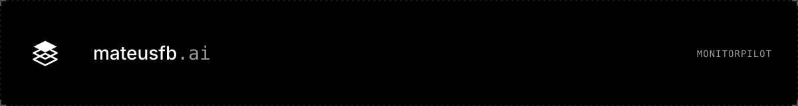
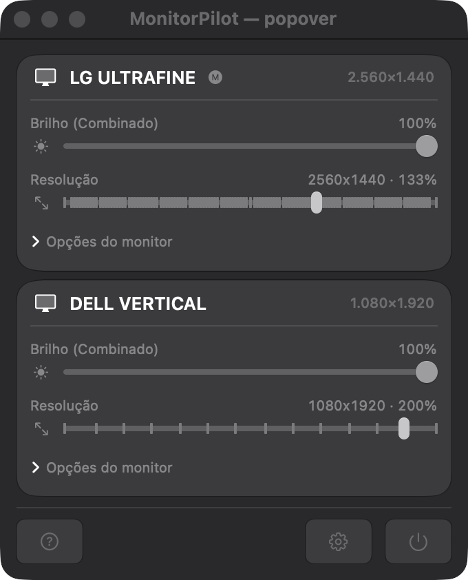
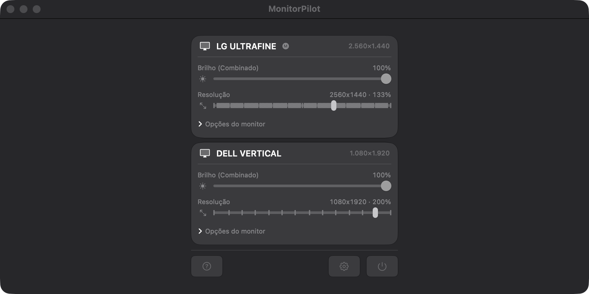

<a href="https://mateusfb-ai.vercel.app"></a>

# MonitorPilot

**Menu-bar + CLI control for every display on your Mac: brightness (hardware, DDC/CI and software), resolution & HiDPI, HDR/XDR boost, virtual displays, mirroring, rotation, PIP and more.** Native Swift, no drivers, no kernel extensions.

<p align="center">
  <a href="https://github.com/spyko-app/monitorpilot/releases/download/v0.1.0/MonitorPilot-0.1.0.dmg"></a>
  &nbsp;
  <a href="https://github.com/spyko-app/monitorpilot/releases"></a>
</p>

<p align="center">
  
</p>

## Features

| Feature | How | Status |
|---|---|---|
| Brightness — Apple displays | `DisplayServices` (private, via `dlopen`) | ✅ |
| Brightness — external monitors | **DDC/CI over I²C** (`IOAVService`, Apple Silicon) with per-port mapping when several monitors are plugged | ✅ read + write verified on LG / Dell |
| Brightness — anything else | software dimming (gamma table) | ✅ |
| **Combined brightness** | one slider: software dimming → hardware → XDR boost, configurable switch-point | ✅ |
| XDR / HDR upscaling | colour-table boost inside the EDR headroom (gamma > 1.0) | ✅ 16× headroom measured on a built-in XDR |
| HDR on/off, Night Shift on/off/strength | `MonitorPanel` / `CBBlueLightClient` | ✅ |
| Resolution & refresh modes, hidden modes | `CGDisplayMode` + private mode list | ✅ |
| HiDPI on any display | virtual display mirrored into the physical one (BetterDummy technique) | ✅ |
| Virtual displays | `CGVirtualDisplay` | ✅ create / destroy, layout restored |
| Mirror / unmirror, rotation, main display | `CGConfigureDisplay*` | ✅ |
| Connect / disconnect a display (software) | `CGSConfigureDisplayEnabled`; orphan displays reconnected on boot / hot-plug | ✅ |
| Presets (monitor picture modes) | `MonitorPanel.framework` | ✅ |
| PIP of another screen, stream a screen to a virtual display | ScreenCaptureKit | ✅ |
| Colour profile per display, ambient-light auto brightness | ColorSync / `DisplayServices` | ✅ |
| Hotkeys | ⌥⌘↑/↓ main display · ⌥⌘←/→ display under the mouse | ✅ |
| Graceful shutdown | SIGTERM undoes mirroring / virtual displays before exit | ✅ |

Config lives in a plain JSON file (`~/.config/monitorpilot/config.json`) so it is versionable and scriptable.

## Requirements

- macOS **14** or newer. DDC/CI needs Apple Silicon (M1 or later).
- Xcode 15+ command line tools.

## Install

### Option A — download the app (recommended)

1. Click the **Download** button above (or grab `MonitorPilot-0.1.0.dmg` from the [Releases](https://github.com/spyko-app/monitorpilot/releases) page).
2. Open the DMG and drag **MonitorPilot** onto the **Applications** shortcut.
3. Open **Applications → MonitorPilot**. The build is signed ad-hoc (not notarized yet), so the first time use **right-click → Open → Open**. Needed only once.
4. A monitor icon appears in the menu bar; click it for the per-display popover (brightness, resolution, monitor options).
5. Optional: add the CLI to your shell — `alias monitorpilot=/Applications/MonitorPilot.app/Contents/MacOS/MonitorPilot`.

PIP and screen streaming ask for **Screen Recording** the first time you click them; nothing is requested at launch.

### Option B — build from source

```bash
git clone https://github.com/spyko-app/monitorpilot.git
cd monitorpilot
./scripts/make-app.sh              # release build → build/MonitorPilot.app (menu bar, ad-hoc signed)
open build/MonitorPilot.app
```

Development:

```bash
swift build                        # debug binary in .build/debug/MonitorPilot
swift test                         # unit tests (pure logic: planners, policies, CLI parser, DDC mapping)
open build/MonitorPilot.app --args --window   # run as a normal window instead of a menu-bar popover
```

## CLI

The same binary is a CLI (BetterDisplay-style vocabulary):

```bash
MonitorPilot list                              # id  name  size  tags
MonitorPilot get brightness LG                 # combined value 0–1
MonitorPilot set brightness 80% LG             # Apple → DDC → (app) software, whichever the display supports
MonitorPilot ddc get brightness LG             # raw VCP 0x10 → "70/100"
MonitorPilot ddc set brightness 40 DELL
MonitorPilot ddc set power 1 LG                # VCP 0xD6 (1 on · 4 standby · 5 off)
MonitorPilot ddc ports                         # which I²C port serves which monitor
MonitorPilot modes LG && MonitorPilot set mode 967 LG
MonitorPilot hdr on LG · MonitorPilot nightshift 0.6
MonitorPilot mirror DELL LG · MonitorPilot unmirror DELL
MonitorPilot disconnect DELL · MonitorPilot connect 3     # connect accepts the raw display id
MonitorPilot pip LG --of "Built-in" · MonitorPilot pip off
MonitorPilot stream LG --to virtual · MonitorPilot stream off
MonitorPilot restore-gamma
```

Display selectors accept an id (`2`), a case-insensitive name fragment (`lg`, `dell`) or nothing (= main display).

Software brightness only survives inside a resident process (the WindowServer resets the gamma table when the process that set it exits), so `set brightness` on a display without a hardware path is forwarded to the running menu-bar app.

> **Safety:** `disconnect` refuses to remove the last display. Do not power-off (DDC `5`) your only monitor — macOS drops it and you are left headless; use `pmset displaysleepnow` for a standby that wakes on input.

<p align="center">
  
</p>

## How DDC works here

Apple Silicon exposes each external port as a `DCPAVServiceProxy`; MonitorPilot writes DDC/CI packets to I²C address `0x37` through `IOAVServiceWriteI2C`. With more than one monitor the proxies carry no display id, so the port is resolved through `AppleDisplayConnectionManager.ConnectionMapping` (role `DCPEXT<n>` → product id / name, byte-swapped against `CGDisplayModelNumber`). If the mapping is ambiguous the write is refused — it never guesses.

Monitors that do not answer (DDC/CI disabled in the OSD, some USB-C docks) automatically fall back to software dimming.

## Project layout

```
Sources/MonitorPilot/
  Core/    BrightnessService, DDCService + DDCPortMapper, ModeService, HiDPI*, VirtualDisplayService,
           SystemService (HDR, mirror, connect), PresetService, PIP/Stream, ReconnectPolicy, ConfigStore…
  UI/      MenuView / PopoverView, SettingsWindow, OSD, PIPWindow
  CLI.swift, Main.swift
Tests/MonitorPilotTests/   62 unit tests
scripts/make-app.sh        bundle builder
```

## Credits

Techniques from BetterDisplay, MonitorControl, m1ddc, BetterDummy and Lunar — re-implemented from public write-ups and IORegistry inspection. No code copied.

## License

[MIT](LICENSE)

---

<p align="center"><a href="https://mateusfb-ai.vercel.app"></a><br><sub>Built in public at <a href="https://mateusfb-ai.vercel.app">mateusfb.ai</a></sub></p>
